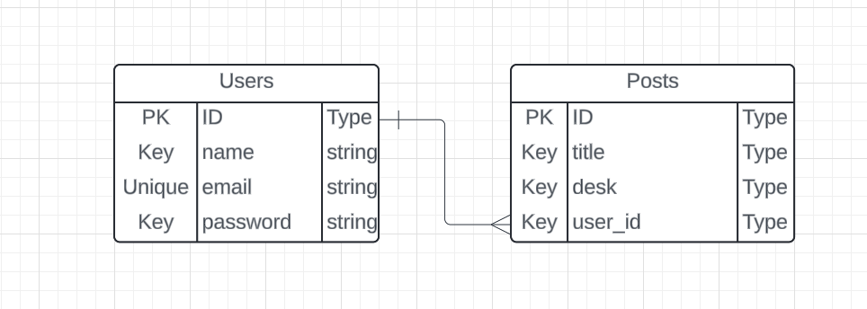

## Dot Project

Projek ini saya bangun menggunakan:

-   [Laravel](https://laravel.com).
-   [Bootstrap](https://getbootstrap.com).
-   [Postman](https://www.postman.com).
-   [Laravel Sanctum](https://github.com/laravel/sanctum).

Projek ini saya bangun sebagai syarat bergabung menjadi bagian dari program magang batch 3 Dot Indonesia, pada projek ini saya membuat saya membuat API.php dan WEB.php menjadi satu projek yang dimana ini baru pertama kali saya melakukan itu.

### Menggunakan

Anda dapat langsung meng-clone projek ini pada komputer jinjing atau komputer anda dengan perintah git clone https://github.com/MuhamadMatin/Dot.git pada terminal anda, setelah projek ter-clone maka anda dapat menggunakan perintah composer install untuk menginstall semua dependensi yang diperlukan untuk projek ini, dan langkah terakhir anda dapat menjalankan perintah php artisan migrate --seed untuk meng-generate database.

### API

API ini berisi beberapa endpoint yang dapat digunakan untuk mengakses data dari database, contoh endpoint ini adalah:

==User==

-   Get /users
-   Post /users
-   Get /users/{users}
-   Put /users/{users}
-   Delete /users/{users}

==Post==

-   Get /posts
-   Post /posts
-   Get /posts/{post}
-   Put /posts/{post}
-   Delete /posts/{post}

==Auth==

-   Post /login
-   Post /register
-   Post /logout

Untuk mengakses endpoint ini, anda harus menggunakan token yang diberikan oleh API, untuk mendapatkan token anda dapat menggunakan perintah Post /api/login, perintah ini akan mengirimkan data Post yang berisi email dan password anda, kemudian API akan mengirimkan token ke endpoint tersebut.
